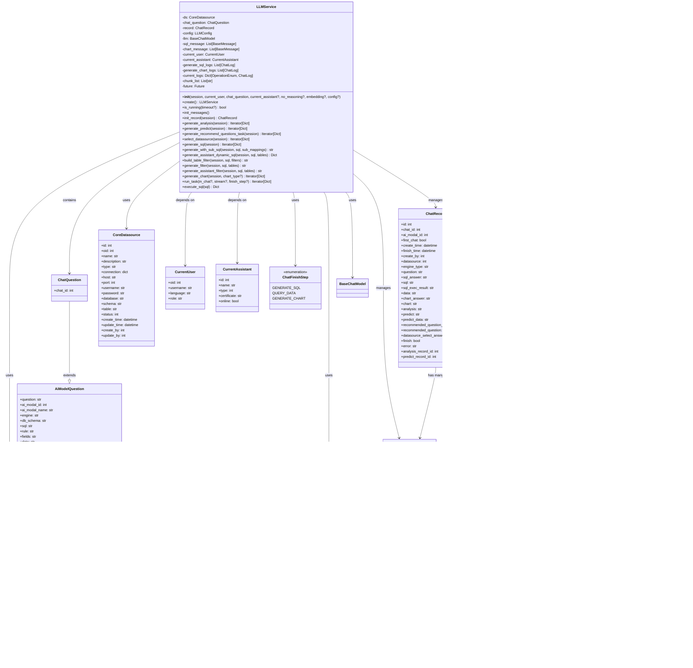

# SQLBot LLMService 核心类图分析

## 1. 核心类图

## 2. 类职责分析

### 2.1 LLMService 类
**核心职责：** SQLBot 的核心服务类，负责协调整个AI问答流程

**主要功能：**
- **生命周期管理：** 初始化配置、消息管理、记录跟踪
- **SQL生成：** 根据用户问题生成SQL查询语句
- **图表生成：** 基于SQL结果生成可视化图表配置
- **数据分析：** 对查询结果进行智能分析和预测
- **数据源管理：** 动态选择和管理数据源连接
- **权限控制：** 实现行级和列级数据权限过滤
- **异步处理：** 支持流式输出和后台任务执行

### 2.2 配置管理类

#### LLMConfig
**职责：** 大语言模型配置管理
- 支持多种LLM类型（OpenAI、Azure、VLLM等）
- 管理API密钥和基础URL
- 支持额外的模型参数配置
- 实现哈希方法，便于缓存和比较

#### AiModelQuestion/ChatQuestion
**职责：** 问题模板管理
- 提供各种系统提示词模板生成方法
- 管理多语言支持
- 集成术语库和训练数据
- 支持自定义提示词

### 2.3 数据模型类

#### ChatRecord
**职责：** 聊天记录数据模型
- 记录完整的问答流程状态
- 存储SQL、图表、分析结果
- 支持异步任务状态跟踪
- 维护错误信息和执行时间

#### ChatLog
**职责：** 操作日志记录
- 记录所有AI模型交互
- 跟踪token使用情况
- 存储推理过程内容
- 支持操作类型分类

### 2.4 LLM集成类

#### BaseLLM及其实现类
**职责：** 大语言模型抽象和具体实现
- 提供统一的LLM接口
- 支持多种模型后端（OpenAI、Azure、VLLM）
- 实现模型配置和参数管理
- 提供流式输出支持

## 3. 核心工作流程

### 3.1 主要交互流程
1. **初始化阶段：** LLMService创建并配置所有依赖对象
2. **数据源选择：** 根据问题内容智能选择合适的数据源
3. **SQL生成：** 基于问题和数据源schema生成SQL查询
4. **权限过滤：** 根据用户权限对SQL进行行级过滤
5. **SQL执行：** 执行查询并获取结果数据
6. **图表生成：** 根据数据特性选择合适的可视化方式
7. **智能分析：** 对查询结果进行深度分析和预测
8. **结果输出：** 流式返回完整的问答结果

### 3.2 异步处理机制
- 使用ThreadPoolExecutor实现后台任务执行
- 支持流式输出，提供实时反馈
- 缓存机制优化重复请求性能
- 错误处理和异常恢复机制

## 4. 设计模式和架构特点

### 4.1 设计模式
- **工厂模式：** LLMFactory创建不同类型的LLM实例
- **策略模式：** 不同的数据源和LLM类型采用不同处理策略
- **建造者模式：** 复杂的问题模板构建过程
- **观察者模式：** 流式输出的数据推送机制

### 4.2 架构特点
- **模块化设计：** 清晰的职责分离和接口定义
- **可扩展性：** 支持新的LLM类型和数据源类型
- **多租户支持：** 基于oid的数据隔离
- **高可用性：** 完善的错误处理和恢复机制
- **性能优化：** 缓存、异步处理和资源池化

这个LLMService类图展现了SQLBot系统在AI问答功能上的核心架构，体现了现代AI应用在服务化、模块化和可扩展性方面的最佳实践。