# SQLBot 后端架构图

```mermaid
graph TB
    subgraph "前端层"
        Frontend[Vue 3 + TypeScript 前端]
    end

    subgraph "API网关层"
        API[FastAPI 网关]
    end

    subgraph "核心服务层"
        subgraph "系统管理模块"
            Login[登录认证]
            User[用户管理]
            Workspace[工作空间管理]
            Assistant[AI助手管理]
            Aimodel[AI模型管理]
        end
        
        subgraph "数据管理模块"
            Datasource[数据源管理]
            TableRelation[表关系管理]
        end
        
        subgraph "AI/LLM服务模块"
            Chat[聊天问答服务]
            Terminology[专业术语管理]
            DataTraining[数据训练服务]
        end
        
        subgraph "可视化模块"
            Dashboard[仪表板服务]
        end
        
        subgraph "MCP服务模块"
            MCP[MCP服务]
        end
    end
    
    subgraph "核心功能层"
        LLMService[LLM服务]
        EmbeddingService[向量嵌入服务]
        SqlGeneration[SQL生成服务]
        ChartService[图表服务]
    end

    subgraph "数据存储层"
        PostgreSQL[(PostgreSQL数据库)]
        VectorDB[(向量数据库)]
        FileStorage[(文件存储)]
    end
    
    subgraph "缓存层"
        Cache[(缓存 - Redis/Memory)]
    end

    subgraph "外部服务"
        AIClient[AI客户端<br/>OpenAI/自定义模型]
        DataSourceClients[外部数据源<br/>MySQL/Oracle/SQL Server等]
    end

    Frontend -- "API请求" --> API
    API -- "路由分发" --> Login
    API -- "路由分发" --> User
    API -- "路由分发" --> Workspace
    API -- "路由分发" --> Assistant
    API -- "路由分发" --> Aimodel
    API -- "路由分发" --> Datasource
    API -- "路由分发" --> TableRelation
    API -- "路由分发" --> Chat
    API -- "路由分发" --> Terminology
    API -- "路由分发" --> DataTraining
    API -- "路由分发" --> Dashboard
    API -- "路由分发" --> MCP

    Login -- "用户认证" --> PostgreSQL
    User -- "用户数据" --> PostgreSQL
    Workspace -- "工作空间数据" --> PostgreSQL
    Assistant -- "助手配置" --> PostgreSQL
    Aimodel -- "模型配置" --> PostgreSQL
    Datasource -- "数据源配置" --> PostgreSQL
    TableRelation -- "表关系数据" --> PostgreSQL
    Chat -- "聊天记录" --> PostgreSQL
    Terminology -- "术语数据" --> PostgreSQL
    DataTraining -- "训练数据" --> PostgreSQL
    Dashboard -- "仪表板配置" --> PostgreSQL

    Chat -- "LLM调用" --> LLMService
    Chat -- "SQL生成" --> SqlGeneration
    Chat -- "向量检索" --> EmbeddingService
    Terminology -- "术语向量化" --> EmbeddingService
    DataTraining -- "训练数据向量化" --> EmbeddingService

    LLMService -- "AI模型调用" --> AIClient
    SqlGeneration -- "执行SQL" --> DataSourceClients
    EmbeddingService -- "向量存储/检索" --> VectorDB

    SqlGeneration -- "生成图表" --> ChartService

    Login -- "缓存用户会话" --> Cache
    Chat -- "缓存查询结果" --> Cache
    Datasource -- "缓存连接信息" --> Cache

    ChartService -- "存储图表" --> FileStorage
    Chat -- "存储文件" --> FileStorage

    classDef frontend fill:#e1f5fe
    classDef apigateway fill:#f3e5f5
    classDef coremodule fill:#e8f5e8
    classDef corefunction fill:#fff3e0
    classDef datastore fill:#ffebee
    classDef cache fill:#f1f8e9
    classDef external fill:#fafafa

    class Frontend frontend
    class API apigateway
    class Login,User,Workspace,Assistant,Aimodel,Datasource,TableRelation,Chat,Terminology,DataTraining,Dashboard,MCP coremodule
    class LLMService,EmbeddingService,SqlGeneration,ChartService corefunction
    class PostgreSQL,VectorDB,FileStorage datastore
    class Cache cache
    class AIClient,DataSourceClients external
```

## 架构说明

### 1. 前端层
- Vue 3 + TypeScript 前端应用
- 负责用户界面展示和交互

### 2. API网关层
- FastAPI 网关
- 统一处理API请求和路由分发

### 3. 核心服务层
包含多个业务模块：

#### 系统管理模块
- 登录认证：用户身份验证
- 用户管理：用户信息和权限管理
- 工作空间管理：基于工作空间的资源隔离
- AI助手管理：助手功能配置
- AI模型管理：大模型配置和管理

#### 数据管理模块
- 数据源管理：支持多种数据库连接
- 表关系管理：数据表关系配置

#### AI/LLM服务模块
- 聊天问答服务：自然语言转SQL服务
- 专业术语管理：业务术语配置
- 数据训练服务：RAG增强训练

#### 可视化模块
- 仪表板服务：数据可视化展示

#### MCP服务模块
- Model Context Protocol服务

### 4. 核心功能层
- LLM服务：大语言模型调用
- 向量嵌入服务：语义搜索和RAG
- SQL生成服务：自然语言转SQL
- 图表服务：数据可视化

### 5. 数据存储层
- PostgreSQL数据库：主要数据存储
- 向量数据库：向量嵌入存储
- 文件存储：Excel、图片等文件

### 6. 缓存层
- Redis或内存缓存：提升系统性能

### 7. 外部服务
- AI客户端：OpenAI或自定义AI模型
- 外部数据源：MySQL、Oracle、SQL Server等

该架构采用模块化设计，支持多租户工作空间隔离，具备完整的AI驱动的自然语言转SQL能力，并通过RAG技术提供更好的查询准确性。